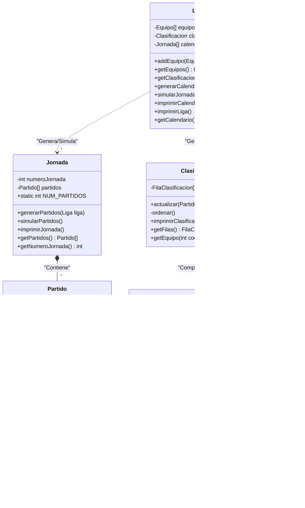

# 🏆 Ejercicio B06.3: Liga de Fútbol Pro

## 📌 Contexto

El objetivo de este ejercicio en crear un software que simule una liga de fútbol profesional. 
El alumno debe ser capaz de crear los clases y métodos necesarios para simular una liga de fútbol profesional, y poder aplicar los conceptos de POO en un problema real.

> [!IMPORTANT]
> **Estructura de paquetes**: 
> - Todas las clases del modelo deben estar en el paquete `com.pg.ligafutbol`.
> - Todas las clases de prueba deben estar en el paquete `com.pg.ligafutbol.test`.

### Objetivos

- Poner en práctica los conceptos de POO.
- Pasar del problema a la solución mediante el diseño de clases y métodos.
- Aplicar los conceptos de encapsulación.

---

## 📝 Tareas a realizar:

### 1. El modelo de datos

Crea las siguientes clases en el paquete `com.pg.ligafutbol`.

El diagrama de clases es el siguiente:



#### A. Clase `Equipo`

Representa a un equipo de fútbol profesional.
- **Atributos**: `nombre` (String) y `codigo` (int).
- **Constructor** y **Getters**.

#### B. Clase `Partido` (Refactorizada)

Ahora los equipos son objetos, no textos.

- **Atributos**: `equipoLocal` (tipo `Equipo`), `equipoVisitante` (tipo `Equipo`), `golesLocal`, `golesVisitante` y `jugado`.
- **Métodos**: Los mismos que en el ejercicio anterior (setResultado, toString, etc.).

#### C. Clase `Jornada`

Agrupa los partidos de una fecha concreta.

- **Atributos**: `numeroJornada` (int), `partidos` (Array de `Partido`)
- **Constante**: `NUM_PARTIDOS` (define cuántos partidos hay por jornada, por ejemplo 10).
- **Métodos**: 

- `generarPartidos(Liga liga)`: Este método debe obtener la lista de equipos de la liga y crear los objetos `Partido` correspondientes para esta jornada.
- `simularPartidos()`: Genera un resultado aleatorio para cada partido y asigna los goles a los equipos correspondientes.
- `imprimirJornada()`: Imprime la jornada con todos los partidos.
- `getPartidos()`: Devuelve el array de partidos.
- `getNumeroJornada()`: Devuelve el número de la jornada.


### D. Clase `FilaClasificacion`

Para no romper la **Responsabilidad Única** de la clase `Equipo`, crearemos esta clase "envoltorio". **Cada objeto `FilaClasificacion` está vinculado a un único `Equipo`** y guarda sus estadísticas acumuladas en la liga.

- **Atributos**: `equipo` (tipo `Equipo`), `puntos`, `partidosJugados`, `golesFavor`, `golesContra`.
- **Método**: `actualizarStats(int misGoles, int susGoles)`: 
    - Se invoca sobre la fila de un equipo concreto. 
    - `misGoles` son los goles marcados por el equipo de esta fila.
    - `susGoles` son los goles recibidos (marcados por el rival).
    - El método incrementa los puntos (3 si gana, 1 si empata, 0 si pierde) y actualiza los contadores de goles.

### E. Clase `Clasificación`

Es la encargada de gestionar el array de todas las filas y de **hacer de puente** entre un partido y las estadísticas.

- **Atributos**: `filas` (Array de `FilaClasificacion`).
- **Métodos**: 
    - `actualizar(Partido p)`: 
        1. Obtiene el `Equipo Local` y `Equipo Visitante` del partido `p`.
        2. Busca en el array de `filas` qué objeto pertenece al local y cuál al visitante.
        3. Para el local, llama a `filaLocal.actualizarStats(p.getGolesL(), p.getGolesV())`.
        4. Para el visitante, llama a `filaVisitante.actualizarStats(p.getGolesV(), p.getGolesL())`.
    - `ordenar()`: (Privado)Ordena el array de filas por puntos (y goles diferencia si hay empates).<br>
       ⚡ Investiga el algoritmo de ordenación **Bubble Sort**, y aplicalo para ordenar el array de filas, y devolver el array ordenado.
    - `imprimirClasificacion()`: Imprime la tabla resumen (Antes de imprimir, ordena el array con `ordenar()`). Para optimizar, no vuelves a ordenar el array si ya está ordenado, debes usar una variable booleana `isOrdenado`.
    - `getFilas()`: Devuelve el array de filas.
    - `getEquipo(int codigo)`: Devuelve el equipo cuyo código coincide con el del equipo pasado como parámetro.


### F. Clase `Liga`

Es el contenedor global.

- **Atributos**: `equipos` (Array de `Equipo`) y `clasificacion` (tipo `Clasificacion`).
- **Métodos**:
    - `addEquipo(Equipo e)`: Añade un equipo al array de equipos.
    - `getEquipos()`: Devuelve el array de equipos.
    - `getClasificacion()`: Devuelve el objeto clasificación.
    - `imprimirLiga()`: Imprime la liga con todos los equipos.
    - `generarCalendario()`: Genera todas las jornadas de la liga.
    - `simularJornadas()`: Simula todas las jornadas de la liga, simulando los partidos y actualizando las estadísticas. Este proceso obtendrá todas las jornadas, por cada una llamará a `jornada.simularPartidos()`, y finalmente llamará a `clasificacion.actualizar(p)` para actualizar las estadísticas de cada partido. 
    - `imprimirCalendario()`: Imprime el calendario de la liga.
    - `imprimirClasificacion()`: Imprime la clasificación de la liga.
    - `imprimirLiga()`: Imprime la liga con todos los equipos.


---

## ⚙️ El Reto: Generación de la Liga

Para que el ejercicio sea funcional, necesitamos una forma de emparejar a los equipos. 

**¿Cómo generar todas las jornadas?**  
Si tienes 5 equipos, habrá 4 jornadas (ida). Una forma sencilla es usar el **Algoritmo de Rotación**:

```java
Algoritmo GenerarCalendario(listaEquipos)
    N = longitud(listaEquipos)
    NumJornadas = N - 1
    PartidosPorJornada = N / 2

    Para jornada Desde 1 Hasta NumJornadas Hacer
        Imprimir "JORNADA " + jornada
        Para i Desde 0 Hasta PartidosPorJornada - 1 Hacer
            Local = listaEquipos[i]
            Visitante = listaEquipos[N - 1 - i]
            Imprimir Local + " vs " + Visitante
        Fin Para

        // Rotación: El primer equipo (índice 0) se queda fijo.
        // El resto de los equipos rotan una posición.
        Ultimo = listaEquipos[N - 1]
        Para k Desde N - 1 Hasta 2 Hacer
            listaEquipos[k] = listaEquipos[k - 1]
        Fin Para
        listaEquipos[1] = Ultimo
    Fin Para
Fin Algoritmo
```
---

## 🎯 Objetivo Final

En tu clase `Main`, debes:
1. Crear una `Liga` con 6 equipos.
2. Generar el calendario y mostrarlo.
3. Simular todas las jornadas.
4. Mostrar la clasificación final.

---

## 📜 Anexo: Bloques de Código para Testing

A continuación se muestran los test que debes implementar para verificar cada clase. Crea estos archivos dentro del paquete `com.pg.ligafutbol.test`.

### 1. Test básico de Equipo
```java
// TestEquipo.java
package com.pg.ligafutbol.test;
import com.pg.ligafutbol.Equipo;

public class TestEquipo {
    public static void main(String[] args) {
        System.out.println(">>> Test: Equipo");
        Equipo e = new Equipo("Real Madrid", 1);
        assert e.getNombre().equals("Real Madrid") : "Error: El nombre no coincide";
        assert e.getCodigo() == 1 : "Error: El código no coincide";
        System.out.println("✅ Equipo verificado.");
    }
}
```

### 2. Test de Partido
```java
// TestPartido.java
package com.pg.ligafutbol.test;
import com.pg.ligafutbol.Equipo;
import com.pg.ligafutbol.Partido;

public class TestPartido {
    public static void main(String[] args) {
        System.out.println(">>> Test: Partido");
        Equipo e1 = new Equipo("Betis", 1);
        Equipo e2 = new Equipo("Sevilla", 2);
        Partido p = new Partido(e1, e2);
        assert !p.isJugado() : "Error: No debería estar jugado";
        p.setResultado(2, 1);
        assert p.isJugado() : "Error: Debería estar jugado";
        assert p.getGolesLocal() == 2 && p.getGolesVisitante() == 1: "Error en goles";
        System.out.println("✅ Partido verificado.");
    }
}
```

### 3. Test de Jornada
```java
// TestJornada.java
package com.pg.ligafutbol.test;
import com.pg.ligafutbol.*;

public class TestJornada {
    public static void main(String[] args) {
        System.out.println(">>> Test: Jornada");
        Jornada jornada = new Jornada(1, 2);
        jornada.addPartido(new Partido(new Equipo("A",1), new Equipo("B",2)));
        jornada.addPartido(new Partido(new Equipo("C",3), new Equipo("D",4)));

        assert jornada.getPartidos().length == 2 : "Error: Longitud incorrecta";
        jornada.simularPartidos();
        for (Partido p : jornada.getPartidos()) {
            assert p.isJugado() : "Error: No se ha simulado el resultado";
        }
        System.out.println("✅ Jornada verificada.");
    }
}
```

### 4. Test de Clasificación (Estadísticas)
```java
// TestClasificacion.java
package com.pg.ligafutbol.test;
import com.pg.ligafutbol.Equipo;
import com.pg.ligafutbol.FilaClasificacion;

public class TestClasificacion {
    public static void main(String[] args) {
        System.out.println(">>> Test: FilaClasificacion (Stats)");
        Equipo e = new Equipo("Valencia", 1);
        FilaClasificacion fila = new FilaClasificacion(e);
        fila.actualizarStats(2, 0); // Gana
        assert fila.getPuntos() == 3 : "Error puntos gana";
        fila.actualizarStats(1, 1); // Empata
        assert fila.getPuntos() == 4 : "Error puntos empate";
        System.out.println("✅ Clasificación verificada.");
    }
}
```

### 5. Test de Liga (Generación y Simulación)
```java
// TestLiga.java
package com.pg.ligafutbol.test;

/**
 * Pruebas para la clase Liga usando asserts.
 * Verifica la generación del calendario y la simulación de resultados.
 * Ejecutar con: java -ea com.pg.ligafutbol.test.TestLiga
 */
public class TestLiga {
    public static void main(String[] args) {
        System.out.println(">>> Test: Liga (Calendario y Simulación)");

        Liga liga = new Liga(4);
        liga.addEquipo(new Equipo("A", 1));
        liga.addEquipo(new Equipo("B", 2));
        liga.addEquipo(new Equipo("C", 3));
        liga.addEquipo(new Equipo("D", 4));

        // 1. Probar generación de calendario
        liga.generarCalendario();
        Jornada[] calendario = liga.getCalendario();

        assert calendario != null : "Error: El calendario no se ha generado";
        assert calendario.length == 3 : "Error: Debería haber 3 jornadas para 4 equipos";
        
        for (Jornada j : calendario) {
            assert j != null : "Error: Jornada nula en el calendario";
            assert j.getPartidos().length == 2 : "Error: Debería haber 2 partidos por jornada";
            for (Partido p : j.getPartidos()) {
                assert p != null : "Error: Partido nulo en la jornada";
                assert !p.isJugado() : "Error: El partido no debería estar jugado aún";
            }
        }

        // 2. Probar simulación
        liga.simularJornadas();
        for (Jornada j : calendario) {
            for (Partido p : j.getPartidos()) {
                assert p.isJugado() : "Error: Los partidos deberían estar jugados tras simularJornadas()";
            }
        }

        System.out.println("✅ Liga (Calendario y Simulación) verificada correctamente.");
    }
}

```

### 6. Simulación Completa
```java
// MainTesting.java
package com.pg.ligafutbol.test;
import com.pg.ligafutbol.*;

public class MainTesting {
    public static void main(String[] args) {
        Liga liga = new Liga(6);
        liga.addEquipo(new Equipo("Real Madrid", 1));
        liga.addEquipo(new Equipo("FC Barcelona", 2));
        liga.addEquipo(new Equipo("Atlético", 3));
        liga.addEquipo(new Equipo("Betis", 4));
        liga.addEquipo(new Equipo("Sevilla", 5));
        liga.addEquipo(new Equipo("Valencia", 6));

        liga.generarCalendario();
        liga.simularJornadas();
        liga.imprimirClasificacion();
    }
}
```


