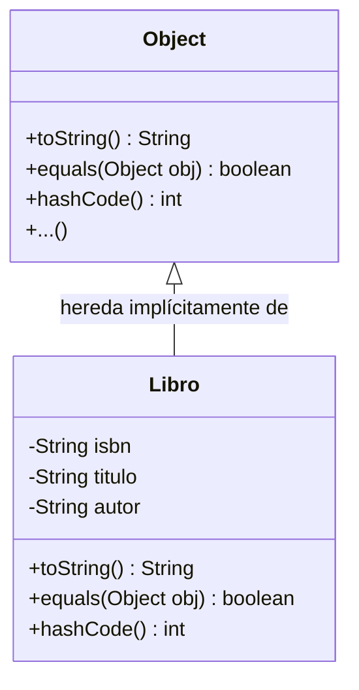

# EC07.0 - Fundamentos de Object: Identidad VS Igualdad

## 🎯 Objetivos
El objetivo de este ejercicio es comprender la diferencia fundamental entre la **identidad** de un objeto (su dirección de memoria) y su **igualdad lógica** (su contenido), así como la importancia de una correcta representación textual de los objetos.

---

## 📚 Contexto

En Java, **todas las clases** heredan implícitamente de la clase madre `Object`. Esto significa que cualquier objeto que crees tiene heredados ciertos métodos, entre ellos:
1. `toString()`: Devuelve una representación en texto del objeto.
2. `equals(Object obj)`: Decide si dos objetos son "iguales".
3. `hashCode()`: Devuelve un número identificador para el objeto.



El problema es que la implementación por defecto de estos métodos (la que viene en `Object`) suele ser insuficiente para nuestros programas.

---

## 🛠️ Ejercicio: La Biblioteca Secreta

Vamos a modelar una clase `Libro` muy simple.

### Parte 1: El problema de la presentación (`toString`)

Crea la clase `Libro` con los siguientes atributos:
- `isbn` (String): El identificador único del libro.
- `titulo` (String).
- `autor` (String).

```java
public class Libro {
    private String isbn;
    private String titulo;
    private String autor;

    public Libro(String isbn, String titulo, String autor) {
        this.isbn = isbn;
        this.titulo = titulo;
        this.autor = autor;
    }
    
    // ... getters y setters ...
}
```

Ahora, crea una clase `TestObject` con un `main`:

```java
Libro l1 = new Libro("123-A", "Java para Novatos", "Pepe Perez");
System.out.println(l1);
```

**Observa:**
Verás algo como `Libro@7ad041f3`. Esto es el nombre de la clase + su código hash en hexadecimal. **No nos sirve**.

👉 **Tarea 1:**
Sobrescribe el método `toString` en `Libro` para que al imprimir salga algo legible, por ejemplo: `"[123-A] Java para Novatos - Pepe Perez"`.

---

## 👯 Parte 2: El dilema de los gemelos (`==` VS `equals`)

Añade lo siguiente a tu `main`:

```java
Libro l1 = new Libro("123-A", "Java para Novatos", "Pepe Perez");
Libro l2 = new Libro("123-A", "Java para Novatos", "Pepe Perez");

if (l1 == l2) {
    System.out.println("Son el mismo objeto (referencia)");
} else {
    System.out.println("Son diferentes objetos (referencia)");
}

if (l1.equals(l2)) {
    System.out.println("Son iguales (contenido)");
} else {
    System.out.println("Son diferentes (contenido)");
}
```

**Análisis:**
- ¿Por qué dice que son diferentes referencias? Porque `new` siempre crea un hueco nuevo en memoria. Son dos objetos físicos distintos ("dos libros idénticos en la mesa").
- ¿Por qué `equals` dice que son diferentes? Porque por defecto, `Object.equals(o)` hace lo mismo que `==`. Compara direcciones de memoria.

👉 **Tarea 2:**
Sobrescribe el método `equals` en la clase `Libro`. Dos libros deben considerarse iguales **si tienen el mismo ISBN**, independientemente del título o autor (asumimos que el ISBN es único).

**Guía de implementación segura de `equals`:**
1. Comprobar si `this == obj` (¿es el mismo objeto físico? -> true).
2. Comprobar si `obj == null` (¿es nulo? -> false).
3. Comprobar clases: `getClass() != obj.getClass()` (¿es otro tipo de objeto? -> false).
4. Hacer **Casting**: Convertir `obj` a `Libro`.
5. Comparar el campo clave: `isbn.equals(otroLibro.isbn)`.

---

## 🤝 Parte 3: El contrato sagrado (`hashCode`)

### 🧠 ¿Qué es un Hash y el HashCode?

Antes de implementarlo, entendamos el concepto:

*   **Hash (resumen)**: Es como una **huella digital** simplificada de un archivo o dato. Imagina que reduces todo el texto de *El Quijote* a un solo número. Si cambias una sola letra del libro, ese número debería cambiar totalmente.
*   **HashCode (en Java)**: Es un número entero (`int`) que representa al objeto. Java usa este número para "organizar" los objetos en memoria rápidamente (como en cajones etiquetados por número).

**La regla de oro inquebrantable:**

> **"Si dos objetos son iguales según `.equals()`, ENTONCES deben tener el mismo `.hashCode()`"**

Aunque ahora mismo no estemos usando colecciones que dependan del hash (como `HashSet` o `HashMap`), **romper esta regla es peligroso**. Si no sobrescribimos `hashCode`, dos libros con el mismo ISBN tendrán códigos hash diferentes (basados en su memoria), violando el contrato.

👉 **Tarea 3:**

Sobrescribe `hashCode` para que sea consistente.
*Pista:* Como la igualdad depende solo del ISBN, el hashcode también debería generarse solo a partir del ISBN.

```java
@Override
public int hashCode() {
    return Objects.hash(isbn); 
    // O si no quieres usar Objects: return this.isbn.hashCode();
}
```

---

## 🧪 Comprobación Final

Amplía tu `main` para verificar que ahora `l1.equals(l2)` devuelve `true` y que `l1.hashCode() == l2.hashCode()` también es `true`.
