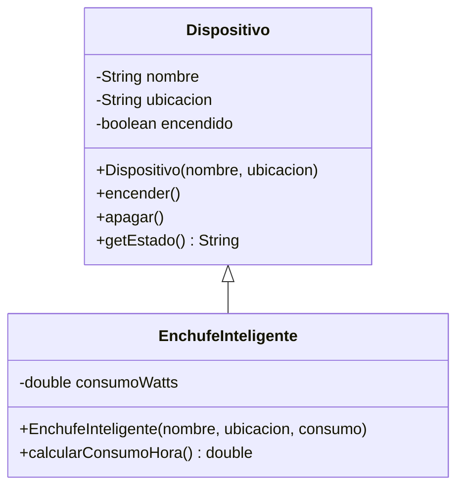
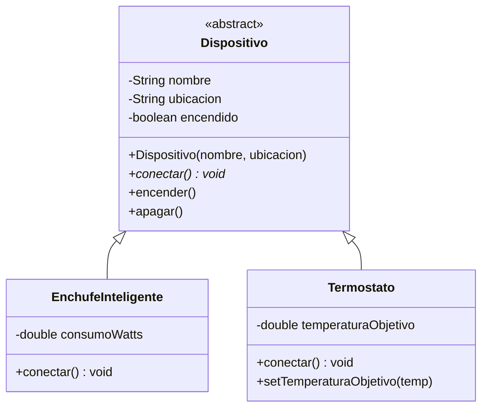
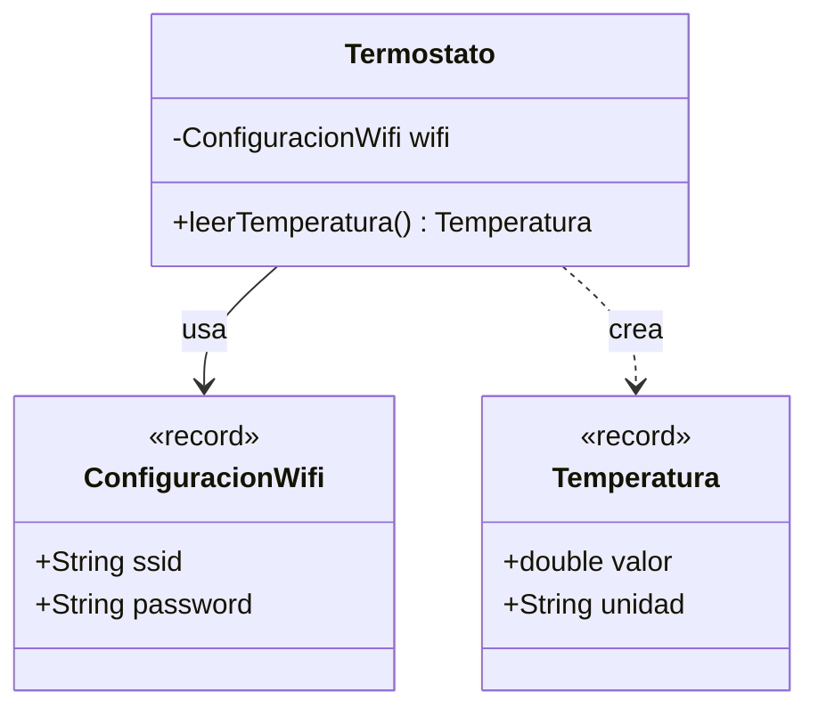
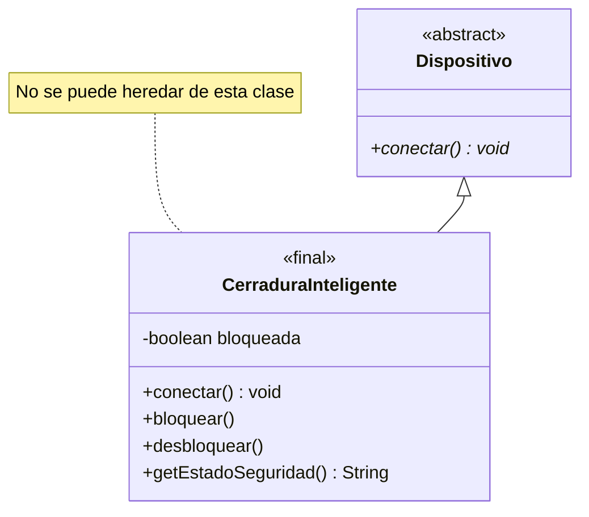

# EC07.1 - Fundamentos de Herencia y Modelado

**Temática**: Sistema de Casa Inteligente (Domótica)

En esta serie de ejercicios construirás el núcleo de un sistema de gestión para dispositivos IoT de una casa inteligente. Aprenderás a modelar jerarquías de clases, usar abstracción y elegir entre tipos mutables e inmutables.

---

## Ejercicio 1: La Base del Sistema 🏠

### Contexto
Toda casa inteligente necesita un sistema central que gestione sus dispositivos. Empezaremos creando la clase base que compartirán todos los dispositivos.

### Objetivo
Crear una jerarquía simple usando herencia y entender el uso de `super` en constructores.

### Enunciado

Crea las siguientes clases:

1. **Clase `Dispositivo`** (clase base):
   - Atributos privados:
     - `String nombre`
     - `String ubicacion` (ej: "Salón", "Cocina")
     - `boolean encendido`
   - Constructor que reciba nombre y ubicación (por defecto, el dispositivo está apagado)
   - Métodos públicos:
     - Getters para todos los atributos
     - `void encender()` y `void apagar()`
     - `String getEstado()` que devuelva "Encendido" o "Apagado"

2. **Clase `EnchufeInteligente`** que herede de `Dispositivo`:
   - Atributo adicional privado:
     - `double consumoWatts`
   - Constructor que reciba nombre, ubicación y consumo
   - Método adicional:
     - `double calcularConsumoHora()` que devuelva el consumo en Wh

### Diagrama de Clases



### Prueba tu código

```java
public class PruebaEjercicio1 {
    public static void main(String[] args) {
        EnchufeInteligente enchufe = new EnchufeInteligente("Enchufe TV", "Salón", 150.0);
        
        System.out.println("Dispositivo: " + enchufe.getNombre());
        System.out.println("Estado: " + enchufe.getEstado());
        
        enchufe.encender();
        System.out.println("Estado tras encender: " + enchufe.getEstado());
        System.out.println("Consumo por hora: " + enchufe.calcularConsumoHora() + " Wh");
    }
}
```

**Salida esperada:**
```
Dispositivo: Enchufe TV
Estado: Apagado
Estado tras encender: Encendido
Consumo por hora: 150.0 Wh
```

> 💡 **Pista: Uso de `super`**
>
> En el constructor de `EnchufeInteligente`, la primera línea debe ser:
> ```java
> super(nombre, ubicacion);
> ```
> Esto invoca al constructor de la clase padre `Dispositivo`.

---

## Ejercicio 2: Abstraer el Comportamiento 🔌

### Contexto
No todos los dispositivos se conectan de la misma manera. Un termostato necesita calibrarse, un enchufe solo necesita activar el relé. Vamos a definir un contrato común.

### Objetivo
Convertir `Dispositivo` en una clase abstracta y obligar a las subclases a implementar su lógica de conexión.

### Enunciado

1. **Modifica la clase `Dispositivo`**:
   - Conviértela en `abstract class`
   - Añade un método abstracto: `abstract void conectar();`

2. **Actualiza `EnchufeInteligente`**:
   - Implementa el método `conectar()` que imprima: `"Enchufe [nombre] conectado al hub"`

3. **Crea una nueva clase `Termostato`** que herede de `Dispositivo`:
   - Atributo adicional privado:
     - `double temperaturaObjetivo`
   - Constructor que reciba nombre, ubicación y temperatura objetivo
   - Implementa `conectar()` que imprima: `"Termostato [nombre] calibrando sensores..."`
   - Método adicional:
     - `void setTemperaturaObjetivo(double temp)`

### Diagrama de Clases



### Prueba tu código

```java
public class PruebaEjercicio2 {
    public static void main(String[] args) {
        Dispositivo[] dispositivos = {
            new EnchufeInteligente("Enchufe Nevera", "Cocina", 200.0),
            new Termostato("Termo Salón", "Salón", 22.0)
        };
        
        for (Dispositivo d : dispositivos) {
            d.conectar();
        }
    }
}
```

**Salida esperada:**
```
Enchufe Enchufe Nevera conectado al hub
Termostato Termo Salón calibrando sensores...
```

??? warning "Importante: Clases Abstractas"
    Una vez que `Dispositivo` es `abstract`, **no puedes hacer** `new Dispositivo(...)`.
    Solo puedes instanciar las clases concretas (`EnchufeInteligente`, `Termostato`).

---

## Ejercicio 3: Datos Puros con Records 📊

### Contexto
Los sensores generan lecturas constantemente. Estas lecturas son datos inmutables que no cambian una vez creados. Además, la configuración WiFi de los dispositivos tampoco debería modificarse una vez establecida.

### 🧠 Teoría: Introducción a Records
Desde Java 14 (preview) y 16 (oficial), tenemos una forma concisa de definir "portadores de datos inmutables": los **Records**.

**El Problema:**
Hasta ahora, para crear una clase simple que solo almacene datos (como unas coordenadas `x, y`), tenías que escribir mucho código repetitivo (*boilerplate*): constructor, getters, `toString`, `equals` y `hashCode`.

**La Solución:**
Un `record` simplifica esto drásticamente. Al definir un record, el compilador genera automáticamente:
- Constructor canónico (con todos los argumentos).
- Métodos de acceso (con el mismo nombre que el campo, ej: `valor()` en vez de `getValor()`).
- `equals()` y `hashCode()` basados en el contenido.
- `toString()` con formato útil.
- La clase y sus campos son `final` (inmutables).

**Comparativa:**

```java
// CLASE TRADICIONAL (Verborrea)
public class Punto {
    private final int x;
    private final int y;
    
    public Punto(int x, int y) { 
        this.x = x; 
        this.y = y; 
    }
    
    // Y faltan getters, toString, equals, hashCode...
}

// RECORD (Conciso y limpio)
public record Punto(int x, int y) {} 
```

### Objetivo

Distinguir entre entidades con identidad (clases) y valores puros (records).

### Enunciado

1. **Crea un `record ConfiguracionWifi`**:
   - Componentes: `String ssid`, `String password`

2. **Crea un `record Temperatura`**:
   - Componentes: `double valor`, `String unidad` (ej: "C" o "F")

3. **Modifica la clase `Termostato`**:
   - Añade un atributo privado: `ConfiguracionWifi wifi`
   - Modifica el constructor para recibir también la configuración WiFi
   - Añade un método: `Temperatura leerTemperatura()` que devuelva una temperatura aleatoria entre 18 y 25 grados Celsius

### Diagrama Conceptual



### Prueba tu código

```java
public class PruebaEjercicio3 {
    public static void main(String[] args) {
        ConfiguracionWifi wifi = new ConfiguracionWifi("MiCasa_5G", "password123");
        Termostato termo = new Termostato("Termo Dormitorio", "Dormitorio", 21.0, wifi);
        
        termo.conectar();
        
        // Leer temperatura 3 veces
        for (int i = 0; i < 3; i++) {
            Temperatura temp = termo.leerTemperatura();
            System.out.println("Lectura " + (i+1) + ": " + temp.valor() + "°" + temp.unidad());
        }
        
        // Intentar modificar el record (esto NO compilará si lo descomentas)
        // temp.valor = 30.0; // ERROR: los records son inmutables
    }
}
```

**Salida esperada (valores aleatorios):**
```
Termostato Termo Dormitorio calibrando sensores...
Lectura 1: 22.3°C
Lectura 2: 19.8°C
Lectura 3: 23.1°C
```

??? tip "Pista: Generar temperatura aleatoria"
    Usa `Math.random()` para generar un número entre 0 y 1, luego escálalo:
    ```java
    double temp = 18 + (Math.random() * 7); // Entre 18 y 25
    return new Temperatura(temp, "C");
    ```

??? info "¿Por qué usar Records?"
    - **`ConfiguracionWifi`**: Es un valor inmutable. Una vez configurado el WiFi, no cambia.
    - **`Temperatura`**: Es una lectura puntual. No tiene sentido "modificar" una lectura pasada.
    - **`Termostato`**: Es una entidad con identidad. Tiene estado que cambia (encendido/apagado, temperatura objetivo).

---

## Ejercicio 4: Seguridad con `final` 🔒

### Contexto
Algunos dispositivos son críticos para la seguridad del hogar. Una cerradura inteligente no debe permitir que otros programadores creen subclases que modifiquen su comportamiento de seguridad.

### Objetivo
Usar el modificador `final` para cerrar una jerarquía y entender sus implicaciones de diseño.

### Enunciado

1. **Crea una clase `CerraduraInteligente`** que herede de `Dispositivo`:
   - Marca la clase como `final`
   - Atributo privado: `boolean bloqueada`
   - Constructor que reciba nombre y ubicación (por defecto, bloqueada = true)
   - Implementa `conectar()` que imprima: `"Cerradura [nombre] verificando credenciales..."`
   - Métodos adicionales:
     - `void bloquear()` - establece bloqueada = true
     - `void desbloquear()` - establece bloqueada = false
     - `String getEstadoSeguridad()` - devuelve "Bloqueada" o "Desbloqueada"

2. **Intenta crear una subclase** de `CerraduraInteligente` (esto debe fallar):
   ```java
   // Esto NO debe compilar
   public class CerraduraHackeada extends CerraduraInteligente {
       // ...
   }
   ```

### Diagrama de Clases



### Prueba tu código

```java
public class PruebaEjercicio4 {
    public static void main(String[] args) {
        CerraduraInteligente cerradura = new CerraduraInteligente("Puerta Principal", "Entrada");
        
        cerradura.conectar();
        System.out.println("Estado: " + cerradura.getEstadoSeguridad());
        
        cerradura.desbloquear();
        System.out.println("Estado tras desbloquear: " + cerradura.getEstadoSeguridad());
        
        cerradura.bloquear();
        System.out.println("Estado tras bloquear: " + cerradura.getEstadoSeguridad());
    }
}
```

**Salida esperada:**
```
Cerradura Puerta Principal verificando credenciales...
Estado: Bloqueada
Estado tras desbloquear: Desbloqueada
Estado tras bloquear: Bloqueada
```

??? warning "¿Por qué `final`?"
    Marcar `CerraduraInteligente` como `final` impide que alguien cree una subclase que:
    
    - Sobrescriba el método `desbloquear()` para hacerlo inseguro
    - Añada puertas traseras al sistema de seguridad
    
    Es una decisión de **diseño**: "Esta lógica es crítica y está completa, no debe modificarse".

---

## 🎯 Desafío Extra (Opcional)

Crea un programa `GestorCasa` que:

1. Cree un array de `Dispositivo[]` con al menos 5 dispositivos diferentes (enchufes, termostatos, cerraduras).
2. Conecte todos los dispositivos usando un bucle.
3. Encienda todos los dispositivos.
4. Muestre un resumen del estado de cada uno.

**Pista**: Usa polimorfismo. Aunque cada dispositivo es de un tipo diferente, todos comparten la interfaz de `Dispositivo`.

---

## 📚 Conceptos Clave Aprendidos

- ✅ **Herencia**: Reutilizar código mediante `extends` y `super`
- ✅ **Clases Abstractas**: Definir contratos con métodos abstractos
- ✅ **Records**: Modelar datos inmutables vs entidades con estado
- ✅ **Final**: Cerrar jerarquías para seguridad y diseño
