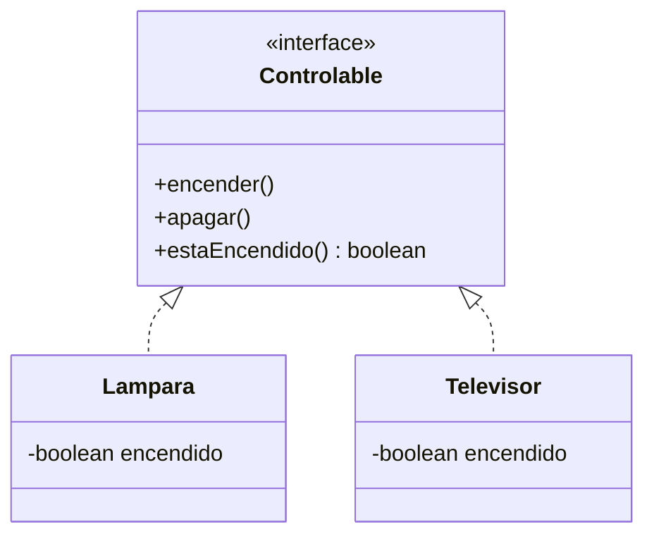
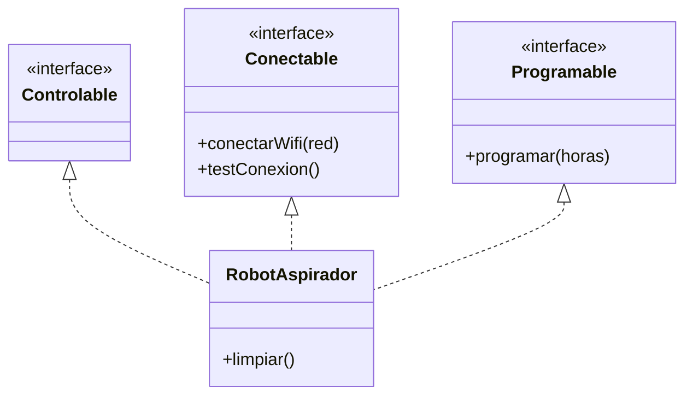
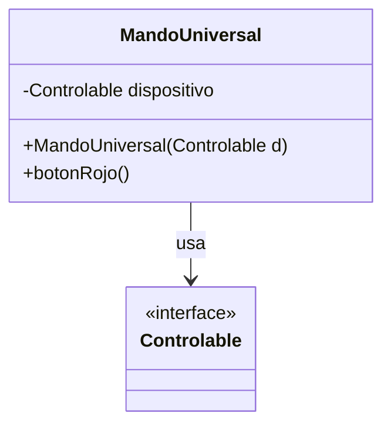

# EC07.2 - Interfaces y Polimorfismo Avanzado

**Temática**: Sistema de Casa Inteligente (Evolución)

En esta segunda parte, expandiremos nuestro sistema domótico para que sea más flexible. Ya no dependeremos solo de la herencia jerárquica (qué *es* un dispositivo), sino de sus capacidades (qué *puede hacer*), utilizando interfaces y polimorfismo avanzado.

---

## Ejercicio 1: Definiendo Habilidades (Interfaces Básicas) 🎛️

### Contexto
Queremos controlar cualquier cosa, no necesariamente un "Dispositivo" de nuestra marca. Una simple bombilla o una tele antigua podrían ser controlables si les ponemos un adaptador. Necesitamos un "contrato" universal de control.

### Objetivo
Definir un comportamiento común mediante una `interface` y desacoplar la implementación de la jerarquía de clases.

### Enunciado

1. **Crea la interfaz `Controlable`**:
   - Métodos abstractos:
     - `void encender()`
     - `void apagar()`
     - `boolean estaEncendido()`

2. **Crea las clases `Lampara` y `Televisor`**:
   - Ambas deben implementar `Controlable`.
   - Deben tener un atributo privado `boolean encendido`.
   - Implementa los métodos para cambiar y consultar el estado, mostrando un mensaje por consola (ej: "Lámpara encendida").

### Diagrama de Clases



### Prueba tu código

```java
public class PruebaEjercicio1 {
    public static void main(String[] args) {
        // Polimorfismo puro con interfaces
        Controlable[] misCosas = {
            new Lampara(),
            new Televisor()
        };
        
        for (Controlable c : misCosas) {
            c.encender();
            System.out.println("¿Está encendido? " + c.estaEncendido());
            c.apagar();
        }
    }
}
```

---

## Ejercicio 2: Múltiples Habilidades y Default Methods 🤖

### Contexto
Un Robot Aspirador es complejo: se mueve, limpia, se conecta al WiFi y se puede programar. Además, queremos que todos los dispositivos conectables tengan una forma estándar de probar su conexión sin obligar a reescribir código siempre.

### Objetivo
Practicar la herencia múltiple de interfaces y el uso de métodos `default`.

### Enunciado

1. **Crea la interfaz `Conectable`**:
   - Método abstracto: `void conectarWifi(String red)`
   - Método **`default`**: `void testConexion()` que imprima "Realizando test de conexión estándar... OK".

2. **Crea la interfaz `Programable`**:
   - Método abstracto: `void programar(int horas)`

3. **Crea la clase `RobotAspirador`**:
   - Debe implementar **tres interfaces**: `Controlable`, `Conectable` y `Programable`.
   - Implementa todos los métodos requeridos con mensajes descriptivos.
   - **Nota**: No es necesario que herede de `Dispositivo` (del EC07.1) para este ejercicio, puede ser una clase independiente.

### Diagrama de Clases



### Prueba tu código

```java
public class PruebaEjercicio2 {
    public static void main(String[] args) {
        RobotAspirador robot = new RobotAspirador();
        
        // Probamos todas sus facetas
        robot.conectarWifi("MiCasa_5G");
        robot.testConexion(); // Método default
        
        robot.programar(12);
        robot.encender();
    }
}
```

---

## Ejercicio 3: Polimorfismo Flexible y Pattern Matching 🔍

### Contexto
En una casa real, tenemos una caja llena de cachivaches mezclados. Necesitamos un sistema que sepa identificar qué es cada cosa y usarlo según sus capacidades, sin que explote el programa.

### Objetivo
Manejar colecciones heterogéneas (`Object[]`) y usar `instanceof` con Pattern Matching (Java 16+) para descubrir capacidades dinámicamente.

### Enunciado

1. Crea una clase `PruebaEjercicio3` con un `main`.
2. Define un **array de Objects** (`Object[]`) con 5 posiciones.
3. Llénalo con una mezcla de objetos: `Lampara`, `Televisor`, `RobotAspirador` y quizás un `String` ("Soy un intruso").
4. Recorre el array con un bucle:
   - Si el objeto es `Controlable`, enciéndelo.
   - Si es `Programable`, prográmalo para dentro de 2 horas.
   - **Específicamente**, si es un `RobotAspirador` (que tiene métodos propios no de interfaz, inventa un método `limpiar()` si no lo hiciste antes), haz que limpie.
   - Si no es nada de lo anterior, imprime "Objeto desconocido".

**Requisito**: Usa la sintaxis moderna de `instanceof` (Pattern Matching).

```java
// Ejemplo de sintaxis antigua (EVITAR)
if (obj instanceof Lampara) {
    Lampara l = (Lampara) obj;
    // ...
}

// Ejemplo Moderno (USAR)
if (obj instanceof Lampara l) {
    l.encender();
}
```

---

## Ejercicio 4: Desacoplamiento (Depender de Abstracciones) 🎮

### Contexto
Queremos fabricar un mando a distancia universal. Si fabricamos un mando que solo funcione con `Televisor`, tendremos que fabricar otro para `Lampara`. Eso es caro e ineficiente.

### Objetivo
Aplicar el principio de Inversión de Dependencia: depender de `Controlable`, no de clases concretas.

### Enunciado

1. **Crea la clase `MandoUniversal`**:
   - Atributo privado: `Controlable dispositivo` (¡Fíjate que es la interfaz!).
   - Constructor: Recibe un objeto `Controlable` y lo asigna.
   - Método `void botonRojo()`: Si el dispositivo está encendido, lo apaga. Si está apagado, lo enciende.

2. **Prueba en el main**:
   - Crea una `Lampara` y un `Televisor`.
   - Crea un `MandoUniversal` asociado a la lámpara y pulsa el botón rojo.
   - Crea otro `MandoUniversal` asociado al televisor y pulsa el botón rojo.

### Diagrama Conceptual



> **Reflexión**: ¿Tu `MandoUniversal` necesita saber cómo funciona internamente la `Lampara`? No. Solo necesita saber que *es controlable*. Eso es desacoplamiento.

---

## Ejercicio 5: Modernizando con Switch Pattern Matching 🔀

### Contexto
El operador `instanceof` es útil, pero cuando tenemos muchas condiciones encadenadas (`if... else if... else if`), el código se vuelve difícil de leer. Desde Java 17 (preview) y 21 (estándar), podemos usar `switch` directamente con tipos.

### Objetivo
Utilizar **Switch Expressions** con **Pattern Matching** para simplificar la lógica de control basada en tipos.

### Enunciado

1. **Crea una clase `UtilidadesDomoticas`**:
   - Define un método estático: `public static String obtenerDetalle(Object objeto)`.
   - Implementa la lógica usando una expresión `switch (objeto)` para devolver un String diferente según el tipo:
     - Si es `Lampara`: "Es una lámpara [Encendida/Apagada]".
     - Si es `RobotAspirador`: "Es un robot aspirador inteligente".
     - Si es `Televisor`: "Es un televisor".
     - Si es `String`: "Es solo texto: [valor del texto]".
     - Si es `null`: "¡Cuidado! Objeto nulo detectado".
     - `default`: "Objeto desconocido de tipo [Nombre de la clase]".

2. **Prueba tu código**:
   - En el `main` de una nueva clase de prueba, llama a `obtenerDetalle` pasando diferentes objetos (incluyendo un `null`).

### Código de Ejemplo (Java 21)

```java
// Así se ve un Switch con Pattern Matching
return switch (objeto) {
    case Lampara l -> "Lámpara (Encendida: " + l.estaEncendido() + ")";
    case RobotAspirador r -> "Robot Aspirador listo";
    case String s -> "Texto: " + s;
    case null -> "Objeto nulo";
    default -> "Tipo desconocido: " + objeto.getClass().getSimpleName();
};
```

> **Nota**: Si tu versión de Java es anterior a la 21, es posible que necesites activar "preview features" o que esta sintaxis no compile. Asegúrate de estar usando Java 21+.

---

## 📚 Conceptos Clave Reforzados

- ✅ **Interfaces**: Definir contratos de comportamiento.
- ✅ **Herencia Múltiple de Tipos**: Una clase puede ser muchas cosas a la vez (`Controlable`, `Conectable`...).
- ✅ **Default Methods**: Añadir funcionalidad a interfaces sin romper implementaciones existentes.
- ✅ **instanceof (Pattern Matching)**: Inspeccionar tipos en tiempo de ejecución de forma segura y concisa.
- ✅ **Desacoplamiento**: Escribir código que dependa de interfaces permite cambiar las piezas ("Clases") sin cambiar el sistema ("MandoUniversal").
