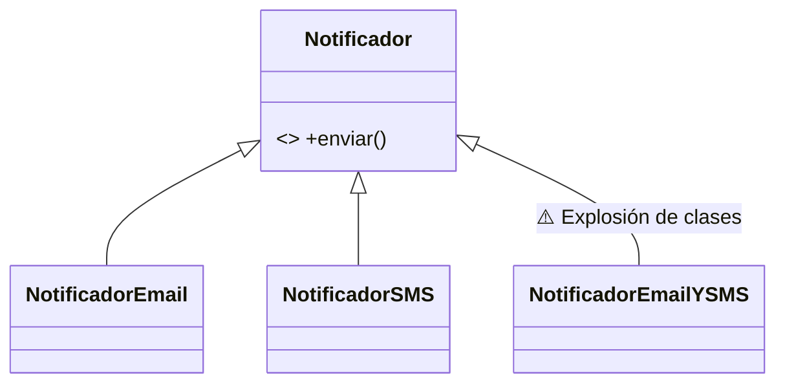
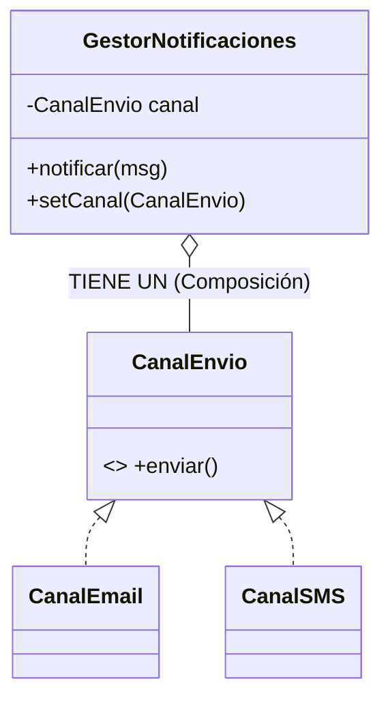

# EC07.3 - Composición vs Herencia 🧩

**Temática**: Sistema de Notificaciones de Seguridad

Hasta ahora hemos usado mucho la herencia ("Es un"). Pero cuando los sistemas crecen, la herencia puede volverse rígida y problemática. En esta práctica descubrirás por qué se suele decir "Prefiere Composición sobre Herencia" y cómo diseñar sistemas más flexibles.

---

## Ejercicio 1: La Trampa de la Herencia (El Problema) 🕸️

### Contexto
Estás diseñando un sistema de alarmas. Al principio, solo necesitabas enviar correos. Luego SMS. Luego ambos. Y pronto te pedirán notificaciones Push. Si intentas solucionar esto solo con herencia, verás que el número de clases explota.

### Objetivo
Demostrar la "explosión combinatoria" de clases al usar herencia para combinar comportamientos.

### Enunciado

1. **Crea una clase abstracta `Notificador`** con:
   - Método abstracto `void enviar(String mensaje)`.

2. **Crea subclases concretas**:
   - `NotificadorEmail`: Imprime "Enviando EMAIL: [mensaje]".
   - `NotificadorSMS`: Imprime "Enviando SMS: [mensaje]".

3. **El Problema**: Ahora el jefe quiere un notificador que envíe **a la vez** por Email y SMS.
   - Crea la clase `NotificadorEmailYSMS` que herede de `Notificador` e implemente ambos comportamientos (tendrás que repetir código o hacer malabares).
   - **Reflexiona**: ¿Qué pasaría si añadimos "WhatsApp"? Tendrías que crear `NotificadorEmailYWhatsApp`, `NotificadorSMSYWhatsApp`, `NotificadorEmailYSMSYWhatsApp`... ¡Es insostenible!

### Diagrama de Clases (Problemático)



---

## Ejercicio 2: La Solución con Composición (Flexibilidad) 🧱

### Contexto
En lugar de ser un tipo fijo de notificador, vamos a hacer que nuestro gestor *tenga* un canal de envío. Así podemos cambiar el canal en caliente sin crear nuevas clases raras.

### Objetivo
Usar el patrón **Composición** (y Strategy simplificado) para desacoplar el "Gestor" del "Mecanismo de envío".

### Enunciado

1. **Define la interfaz `CanalEnvio`**:
   - Método: `void enviar(String mensaje)`.

2. **Crea implementaciones del canal**:
   - `CanalEmail`: Imprime "EMAIL: ...".
   - `CanalSMS`: Imprime "SMS: ...".

3. **Crea la clase `GestorNotificaciones`**:
   - Atributo privado: `CanalEnvio canal` (¡Composición: TIENE UN canal!).
   - Constructor: Recibe el canal inicial.
   - Método `void notificar(String mensaje)`: Delega el envío al canal (`canal.enviar(mensaje)`).
   - Método `void setCanal(CanalEnvio nuevoCanal)`: Permite cambiar el canal dinámicamente.

### Diagrama de Clases (Solución)



### Prueba tu código

```java
public class PruebaComposicion {
    public static void main(String[] args) {
        // Empezamos usando Email
        GestorNotificaciones gestor = new GestorNotificaciones(new CanalEmail());
        gestor.notificar("Alerta de intrusión 1");
        
        // ¡Cambiamos a SMS en tiempo de ejecución!
        System.out.println("--- Cambiando a canal de emergencia ---");
        gestor.setCanal(new CanalSMS());
        gestor.notificar("Alerta de intrusión 2");
    }
}
```

---

## Ejercicio 3: Composición Múltiple (Arrays) 📢

### Contexto
¿Y si queremos enviar por Email Y por SMS? Con herencia era un pesadilla (`NotificadorEmailYSMS`). Con composición es trivial: simplemente nuestro gestor puede *tener* **varios** canales, no solo uno.

### Objetivo
Utilizar arrays para componer un objeto con múltiples dependencias.

### Enunciado

1. **Crea la clase `NotificadorMultiCanal`**:
   - Atributo: `CanalEnvio[] canales` (Array de interfaces).
   - Constructor: Recibe el array de canales ya creados.
   - Método `void notificarTodos(String mensaje)`: Recorre el array y envía el mensaje por cada uno de los canales configurados.

2. **Prueba**:
   - Crea un array con `new CanalEmail()` y `new CanalSMS()`.
   - Instancia el notificador pasándole ese array.
   - Llama a `notificarTodos`. ¡Verás que salen ambos mensajes sin haber creado ninguna clase "Mixta"!

```java
CanalEnvio[] misCanales = { new CanalEmail(), new CanalSMS() };
NotificadorMultiCanal multi = new NotificadorMultiCanal(misCanales);
multi.notificarTodos("¡Fuego en la cocina!");
```

---

## Ejercicio 4: Desafío de Diseño - Sistema de Seguridad 📹

### Contexto
Un "Sistema de Seguridad" suele tener cámaras y sensores. Un error común de novato es pensar: "El sistema *es* como una cámara grande", y heredar de `Camara`. ¡Error! Un sistema *TIENE* cámaras.

### Enunciado

1. **Clases Componentes**:
   - `Camara` con método `grabar()`.
   - `SensorMovimiento` con método `detectar()`.

2. **Clase `SistemaSeguridad`**:
   - No debe heredar de nada.
   - Debe tener (composición) una `Camara` y un `SensorMovimiento` como atributos.
   - Constructor que inicialice ambos componentes.
   - Método `void activarProtocolo()`: Debe llamar a `detectar()` del sensor y luego a `grabar()` de la cámara.

### Reflexión Final
Al usar composición:
- Puedes cambiar la cámara por una `CamaraTermica` (si usas interfaces o herencia en la cámara) sin tocar el `SistemaSeguridad`.
- El `SistemaSeguridad` no se contamina con métodos de la cámara (no heredas cosas que no necesitas).

---

## 📚 Conceptos Clave Reforzados

- ✅ **Herencia (IS-A)**: Útil para jerarquías reales, pero rígida para combinar comportamientos.
- ✅ **Composición (HAS-A)**: Más flexible. Permite cambiar partes del código en tiempo de ejecución.
- ✅ **Inyección de Dependencias**: Pasar los objetos que necesitamos (los canales) en lugar de crearlos dentro.
- ✅ **Delegación**: El `Gestor` no envía el mensaje él mismo, se lo *delega* al objeto `canal`.
